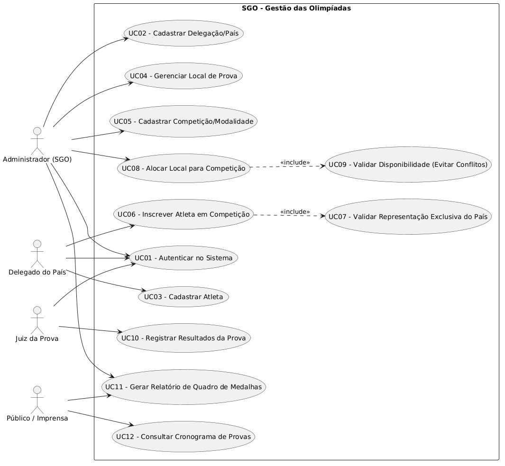
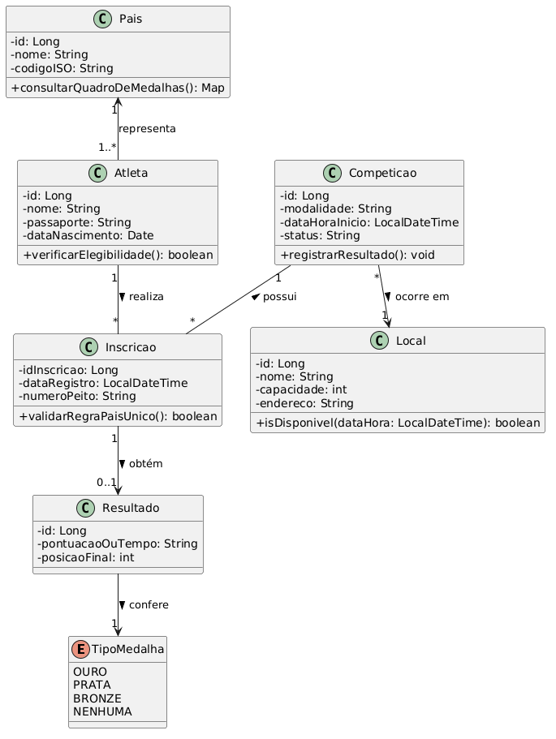
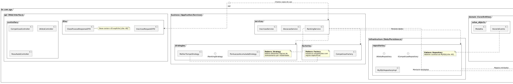
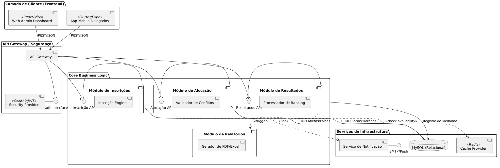
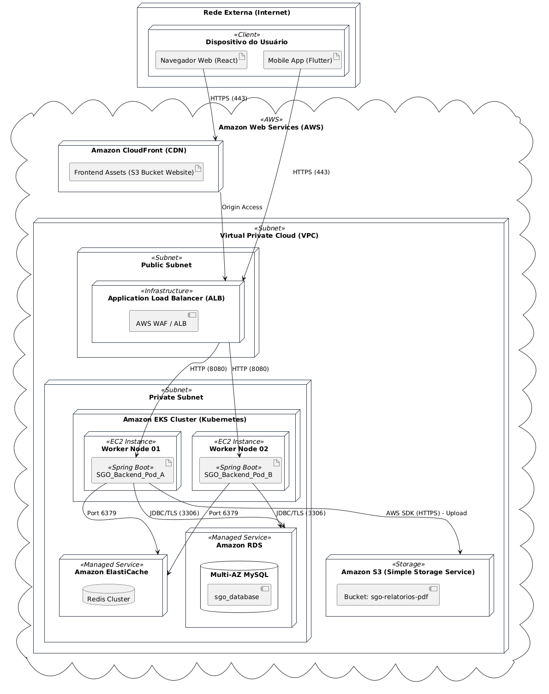

# SGO - Sistema de Gestão das Olimpíadas

[cite_start]Este projeto apresenta a modelagem de um sistema para coordenar competições, inscrições de atletas, alocação de locais e controle de resultados para um evento olímpico[cite: 6, 7].

## 📋 Histórias de Usuário (User Stories)

### US001 - Autenticação e Perfis de Acesso
**Eu como** usuário do sistema, **quero** realizar login com minhas credenciais, **para que** eu possa acessar as funcionalidades específicas do meu perfil.
* **Critérios de Aceitação:**
    * O sistema deve validar e-mail e senha.
    * O acesso deve ser restrito conforme o nível de permissão (Administrador, Delegado, Juiz ou Público).

### US002 - Cadastro de Países/Delegações
**Eu como** Administrador, **quero** cadastrar os países participantes, **para que** possamos organizar as medalhas e delegações corretamente.
* **Critérios de Aceitação:**
    * Deve ser informado o Nome do País e a Sigla (ex: BRA, USA).
    * O sistema deve impedir nomes de países duplicados.

### US003 - Cadastro de Atletas
[cite_start]**Eu como** Delegado do País, **quero** cadastrar os atletas da minha delegação, **para que** eles possam ser inscritos nas competições[cite: 11].
* **Critérios de Aceitação:**
    * [cite_start]É obrigatório informar Nome Completo, Passaporte e País de origem[cite: 13].
    * [cite_start]Um atleta deve estar vinculado obrigatoriamente a um único País em cada modalidade[cite: 13].

### US004 - Cadastro de Locais de Prova
[cite_start]**Eu como** Administrador, **quero** cadastrar os ginásios e arenas, **para que** possamos alocar as competições neles[cite: 14].
* **Critérios de Aceitação:**
    * Deve-se informar Nome do Local, Endereço e Capacidade.
    * O local deve estar disponível no sistema para futuras alocações.

### US005 - Cadastro de Modalidades e Competições
[cite_start]**Eu como** Administrador, **quero** cadastrar as competições, **para que** o cronograma olímpico seja montado[cite: 9].
* **Critérios de Aceitação:**
    * [cite_start]O sistema deve exigir Nome da Modalidade, Data e Horário[cite: 10].
    * [cite_start]A competição deve ser vinculada a um Local cadastrado[cite: 10].

### US006 - Inscrição de Atletas em Competições
[cite_start]**Eu como** Delegado do País, **quero** inscrever meus atletas em provas específicas, **para que** eles possam competir pelas medalhas[cite: 12].
* **Critérios de Aceitação:**
    * [cite_start]O sistema deve garantir que o atleta represente apenas um país naquela modalidade[cite: 13].
    * [cite_start]Um atleta pode participar de várias competições diferentes[cite: 13].

### US007 - Alocação e Prevenção de Conflitos
[cite_start]**Eu como** Administrador, **quero** que o sistema valide o uso dos locais, **para que** não ocorram duas competições no mesmo local e horário[cite: 15].
* **Critérios de Aceitação:**
    * [cite_start]O sistema deve impedir o salvamento de uma competição se o local já estiver ocupado no mesmo período[cite: 16].

### US008 - Gerenciamento de Cronograma
**Eu como** Público, **quero** consultar o cronograma de provas, **para que** eu possa saber quando e onde ocorrerão as competições.
* **Critérios de Aceitação:**
    * O sistema deve permitir filtros por Data ou Modalidade.
    * A listagem deve exibir o local e horário da prova.

### US009 - Registro de Resultados e Posições
[cite_start]**Eu como** Juiz da Prova, **quero** registrar os resultados dos atletas, **para que** o sistema determine os vencedores[cite: 17].
* **Critérios de Aceitação:**
    * [cite_start]O sistema deve registrar obrigatoriamente o 1º, 2º e 3º lugares para definir as medalhas[cite: 18].

### US010 - Atribuição de Medalhas
[cite_start]**Eu como** Sistema, **quero** converter as três primeiras posições em medalhas (Ouro, Prata e Bronze), **para que** o ranking seja atualizado automaticamente[cite: 18].
* **Critérios de Aceitação:**
    * 1º lugar = Ouro; 2º lugar = Prata; [cite_start]3º lugar = Bronze[cite: 18, 20].

### US011 - Relatório de Quadro de Medalhas
[cite_start]**Eu como** usuário, **quero** visualizar o ranking geral de medalhas, **para que** eu acompanhe o desempenho dos países[cite: 19, 20].
* **Critérios de Aceitação:**
    * [cite_start]O ranking deve ser ordenado por medalhas de Ouro, seguido por Prata e Bronze[cite: 20].

### US012 - Histórico do Atleta
**Eu como** Administrador, **quero** visualizar o histórico de um atleta, **para que** eu possa verificar em quais provas ele competiu e quais resultados obteve.
* **Critérios de Aceitação:**
    * O sistema deve listar todas as inscrições e medalhas conquistadas individualmente.

---

## 🖼️ Diagramas UML

### 1. Diagrama de Caso de Uso

### 2. Diagrama de Classes

### 3. Diagrama de Pacotes

### 4. Diagrama de Componentes

### 5. Diagrama de Implantação (AWS)

---

## 🛠️ Tecnologias Utilizadas na Modelagem
* [cite_start]**PlantUML**: Para geração dos diagramas via código[cite: 58].
* **Arquitetura AWS**: Para a infraestrutura de TI (EKS, RDS, S3, CloudFront).
